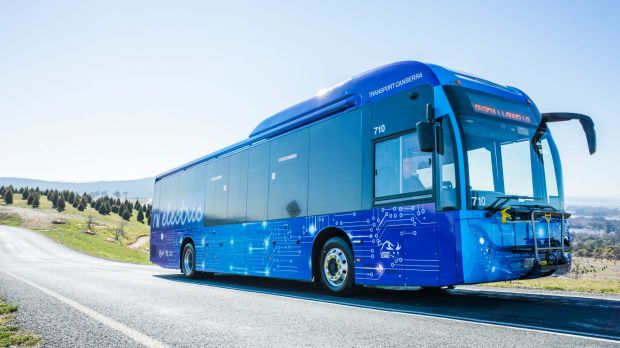

# Image Captioning
this is a deep learning project, which has used the concept of AutoEncoders or Popularly known as seq2seq models. 

## Description
the deep learning model takes input as an image and then tries to output a sentence which describes the image, like below

will output 
``
